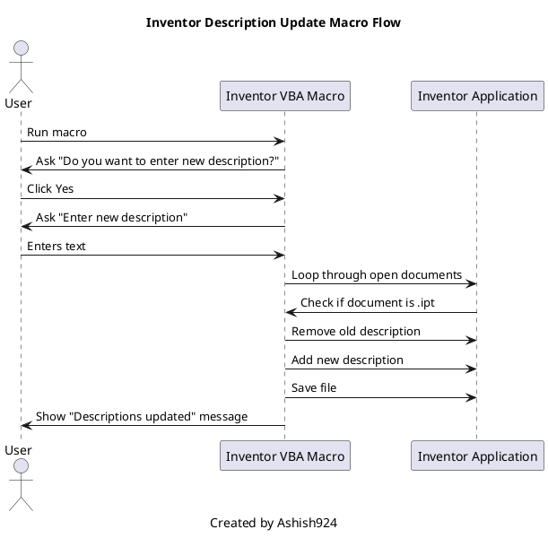

# 🛠️ Inventor IPT Description Updater

A simple VBA macro for Autodesk Inventor that removes existing descriptions and applies a new user-defined description to all open `.ipt` (Part) files. Created by **Ashish924**.

---

## ✨ Features

* Prompts user to confirm before changing descriptions
* Requests user input for new description text
* Clears old descriptions before applying new ones
* Updates **all currently open `.ipt` files**
* Saves changes automatically

---

## 🚀 How to Use

1. **Open Autodesk Inventor**
2. Ensure at least one `.ipt` part file is open.
3. Press `Alt + F11` to open the **VBA Editor**
4. Insert a **new Module**
5. Paste the provided macro code into the module
6. Run the macro: `UpdateDescriptionInAllOpenIPTs`

---

## 🧠 Workflow Diagram

